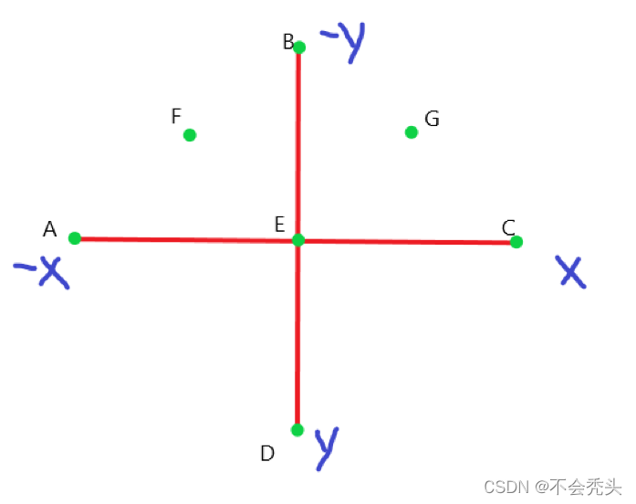

# 设计知识学习

1. 若干部分举例

# 结构设计知识

1. html主要部分包括

    ```html
        .box 
            div
                img
            div
                img
            div
                img
    ```

2. css 部分基本原理
    - body部分居中,最小高度占据整个视口
    - .box 相对定位, 并且设置一定的宽度和高度,并且设置了一个动画

        ```css
            transform-style: preserve-3d;
        ```

    - .box div 使用绝对定位,同时宽度和高度占据父元素的100%,每个div元素沿着y轴旋转对应的45deg*i,利用translateZ(300px)向外推出300px;利用-webkit-box-reflect设置上下的镜像

        ```css
        .box div {
            position: absolute;
            top:0;
            left: 0;
            width: 100%;
            height: 100%;
            transform-style: preserve-3d;
            transform-origin: center;
            transform: rotateY(calc(45deg * var(--v)))
            translateZ(300px)
            ;
            -webkit-box-reflect: below 0px linear-gradient(transparent,transparent,#0004);
        }
        ```

    - img设置占据父元素100%的空间
    - 定义了一个.spin动画, 用于将某个元素沿着y轴中心旋转360deg
    - 这样达到的效果是box沿着y轴中心旋转360deg,选中的图片沿着y轴中心旋转360deg,不同的区别是box是整个父元素旋转,这个元素实际上是带着(推开以后的子元素)进行旋转,而选中的图片是没有推开(translateZ(0px))

3. js部分使用就是为选中的图片对应的div添加一个旋转动画(这个公动画没有沿着z轴推出距离)

# 设计说明

1. 旋转的图片的个数最好能够被360整除，这样计算每个图片绕着Y轴旋转的角度比较方便,
   具体的实现过程就是绕着Y轴旋转后，使用translateZ一定的像素，同时配合perspective属性就能显示3d效果,
   在这里具体旋转的是父元素box,子元素跟着父元素旋转.  
2. -webkit-box-reflect属性倒影的使用能增加设计的3D感.  
3. spin动画覆盖了父元素box的动画属性translateZ,这样让有span类元素的div回到了旋转的中心.  

# 知识点

1. perspective属性的使用.
2. 子元素动画混合父元素动画的技巧.

# 疑问
1. 子元素会不会覆盖父元素的动画,还是混合父元素的动画?如果动画有冲突，是否存在一个优先级的问题?  



```css
    A transform-origin: 0 50%
    B transform-origin: 50% 0
    C transform-origin: 100% 50%
    D transform-origin: 50% 100%
    E transform-origin: 50% 50%
    F transform-origin: 25% 25%
    G transform-origin: 75% 25%
```