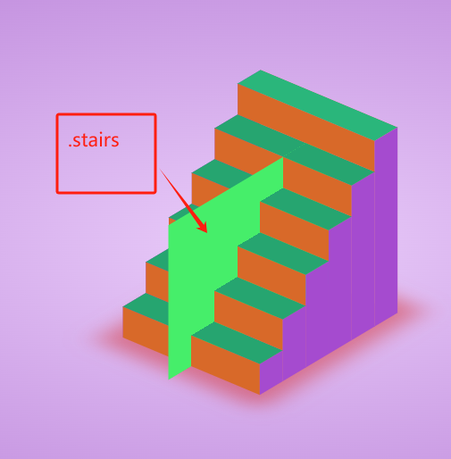
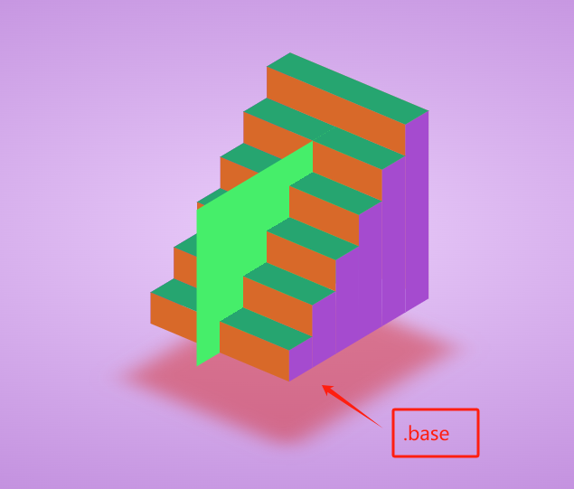
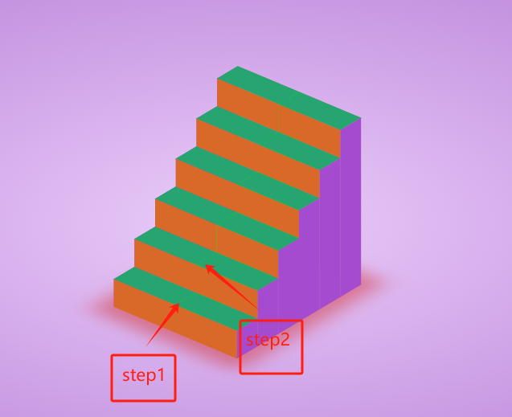
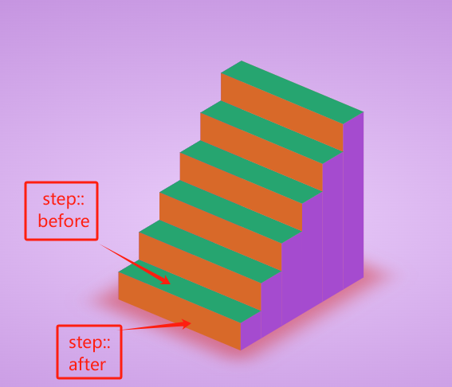

# 3d stairs design step

## 结构设计知识

1. html主要部分包括

    ```html
        .stairs
            div.base
            div.step
                i
                i
            div.step
                i
                i
            div.step
                i
                i
            *
            *
            *
    ```

2. css 部分基本原理
    - body 占据全部视口,配置了一个渐变
    - .stairs采用绝对定位,宽度500，高度300,.stairs是主体容器,在这里主要起到带动整个楼梯旋转的作用

    ```css
        .stairs {
            position: relative;
            width: 500px;
            height: 300px;
            background: rgb(70, 238, 106);
            transform-style: preserve-3d;
            transform: rotateX(-30deg) rotateY(50deg);
            /* animation: animate 10s linear infinite; */
            /* animation-play-state: paused; */
        }
    ```

    我们首先注释掉这段代码animation: animate 10s linear infinite;然后放出background: rgb(70, 238, 106);
    
    这部分是整个楼梯的基本骨架,然后是.base这个div，这是一个宽度360，高度300的底座，这个实现的原理是相对于.stairs绝对定位右移60px,沿着x轴旋转90deg,然后沿着z轴移动150px(其实就是.stairs的一半,方向是向视口的里面, 这里我们可以适当调整这个移动的距离看看效果)
    
    - 最关键的就是.step啦,因为这个是相对于.stairs定位,我先隐藏父元素,看下面的图
    
    这些step是宽度为60，高度分别为60,120....360的长方形,同时它们分别相遇与父元素右移60,120...360px;实际上可以认为是紫色部分往中间推动150px

    - 剩下最关键的就是.step对应的::before和::after啦
    
    看上面的图片,实际上就是宽度60,高度300,旋转90deg,然后往z轴外面移动高度的一半(150px)
    同理::after就是一个宽度300，高度60的长方形沿着y轴旋转90deg,然后向z轴内部移动宽度的一半(150px)

    - 最后一步就是侧面的封盖,实际上就是宽度60,高度为父元素100%的长方形往两边各移动150px就封装OK了
    - 最后一个大的背面封盖有多重实现方式,这里是相对于最后一个i元素来进行定位啦


## 主要知识点

1. 设计底座旋转的方法,父元素的x轴，y轴旋转一定的角度，然后沿着y轴旋转，同时子元素需要垂直与父元素的平面即可设计旋转的底座.  
2. 为了理解3d设计的效果,可以将stairs,base,step设计成不同的颜色，便于观看,同时记住一点，旋转的轴是stairs元素的y轴.  
3. 不同的元素经过旋转变化后，它们的z轴一定垂直于xy平面，比如在设计.stairs .step::before整个伪元素时需要使用这样的考虑.  
4. 因为有六级阶梯，因此采用6个step元素来设计. 
5. 阶梯的四个围绕面,包括两个梯面和两个保护面都是以step为参照主元素. 

# 知识点
1. 3d中底座方法的设计.  
2. 阶梯的两个梯面如何用伪元素设计.  
3. 阶梯的左右保护面如何设计.

# 疑问
1. 阶梯的最后一个背面是否还有其他设计方法?  

# 一个推荐的结构

1. Name
2. Intent and Sketch
3. Summary
4. How it works?
5. When to use it?