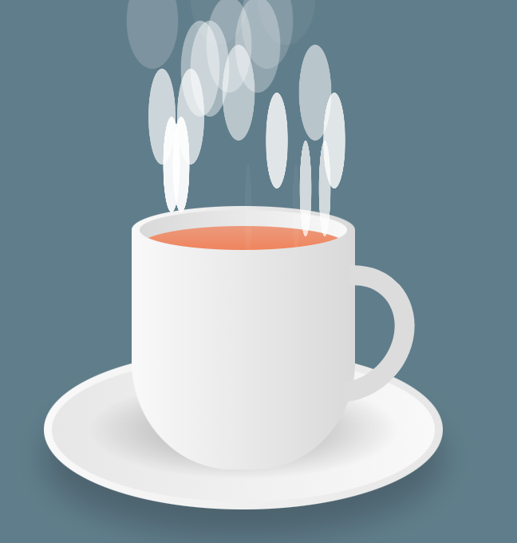

# cup-tea deep design 

1. html 基本结构

    ```html
    .container
        .plate
        .cup
            .top
                .vapour
                .circle
                    .tea
            .handle
    ```

2. css 基本原理
    - body居中,.container 采用相对定位来给整个容器绑定一个锚
    - .cup 也是采用相对定位，固定宽高的容器
    

    ```css
    .cup {
        position: relative;
        width: 280px;
        height: 300px;
        background:linear-gradient(to right, #f9f9f9, #d9d9d9);
        border-bottom-left-radius: 45%;
        border-bottom-right-radius: 45%;
    }
    ```

    .top 采用了规定高度，容器宽度的矩形,同时border-radius:50%才构造杯子顶部的椭圆形,这里就采用绝对定位,注意left:0; top:-30 恰好上移整个矩形高度的一半
    

    ```css
    .top {
        position: absolute;
        width: 100%;
        height: 60px;
        top:-30px;
        left: 0;
        background: linear-gradient(to right, #f9f9f9, #d9d9d9);
        border-radius:50%;
    }

    ```

    - 内部的.circle是相对于top定位啦,注意这里我们需要关注的是为了让内部的小椭圆在中心,这里的top,left是怎么计算出来的;同时这里添加了overflow是为了放置tea溢出

    ```css
    .circle {
        position: absolute;
        <!-- (父容器高度 - 子元素高度) / 2 (60 - 50) / 2 === 5 -->
        top: 5px;
        left: 10px;
        <!-- 20 / 2 === 10 -->
        width: calc(100% - 20px);
        height:50px;
        background: linear-gradient(to left, #f9f9f9, #d9d9d9);
        border-radius:50%;
        box-sizing:border-box;
        overflow:hidden;
    }
    ```

    - .tea 也采用了和.circle一样的样式设计，只不过向下移动了20px;然后父元素覆盖掉了茶水元素

    ```css
    .tea {
        position:absolute;
        top:20px;
        left:0;
        width:100%;
        height:100%;
        background:linear-gradient(#ec9a7c,#f17649);
        border-radius:50%;
    }
    ```

    - .handle的设计原理如下图所示:
        1. 相对于父元素绝对定位
        
        
        
        
        

        这里的关键是理解border-radius:50%形成弧线的原理;如果不理解可以写一个小项目的测试学习一下

        ```css
        .handle {
            position: absolute;
            /* right: -70px; */
            /* top: 40px; */
            width: 160px;
            height: 180px;
            border: 25px solid #50b169;
            border-left: 25px solid transparent;
            border-bottom: 25px solid transparent;
            /* border-radius: 50%; */
            /* transform: rotate(42deg); */
        }

        <!-- 定位到指定位置 -->
        .handle {
            position: absolute;
            right: -70px;
            top: 40px;
            width: 160px;
            height: 180px;
            border: 25px solid #5ce18b;
            border-left: 25px solid transparent;
            border-bottom: 25px solid transparent;
            /* border-radius: 50%; */
            /* transform: rotate(42deg); */
        }

        <!-- 构建handle的弧线 -->
        .handle {
            position: absolute;
            right: -70px;
            top: 40px;
            width: 160px;
            height: 180px;
            border: 25px solid #5ce18b;
            border-left: 25px solid transparent;
            border-bottom: 25px solid transparent;
            border-radius: 50%;
            /* transform: rotate(42deg); */
        }

        <!-- 旋转一定的角度后于杯身吻合 -->
        .handle {
            position: absolute;
            right: -70px;
            top: 40px;
            width: 160px;
            height: 180px;
            border: 25px solid #5ce18b;
            border-left: 25px solid transparent;
            border-bottom: 25px solid transparent;
            border-radius: 50%;
            transform: rotate(42deg);
        }
        ```

    - .plate 的设计就简单啦,其实就是三层椭圆的堆叠

    ```css
    .plate {
        position:absolute;
        bottom:-50px;
        left:50%;
        transform:translateX(-50%);
        width:500px;
        height:200px;
        background: linear-gradient(to right, #f9f9f9, #e7e7e7);
        border-radius:50%;
        box-shadow: 0 35px 35px rgba(0,0,0,0.2);
    }
    
    .plate::before {
        content:'';
        position:absolute;
        inset:10px;
        border-radius:50%;
        background: linear-gradient(to left, #f9f9f9, #e7e7e7);
    }
    .plate::after {
        content:'';
        position:absolute;
        inset:30px;
        background: radial-gradient(rgba(0,0,0, 0.2) 25%, transparent, transparent);
        border-radius:50%;
    }
    ```

    - 最后就是茶杯的雾气啦
    
    雾气的容器是一个矩形,采用相对定位和flex布局

    ```css
    .vapour {
        position:relative;
        display:flex;
        z-index:1;
        padding:0 20px;
    }

    .vapour span {
        position:relative;
        bottom:50px;
        display:block;
        margin:0 2px 50px;
        min-width:8px;
        height:120px;
        background:#fff;
        border-radius:50%;
        animation: animate 5s linear infinite;
        opacity:0;
        filter: blur(8px);
        animation-delay: calc(var(--i) * -0.5s);
    }
    ```

    雾气是一些高120px,宽度8px的矩形条;同时增加了border-radius:50%后的小长条椭圆,初始化是看不见的;
    然后为每个元素增加动画:从看不见到看见到最后消失,这个功能就是opacity的动画,同时这些元素从0开始一直到-300px;其实就是向上方运动,同时x方向上不断扩大;
    
    
    
    以上动画就是控制以下两个属性实现的
    filter: blur(8px);
    animation-delay: calc(var(--i) * -0.5s);

    ```css
    @keyframes animate {
        0% {
            transform: translateY(0) scaleX(1);
            opacity:0;
        }
        15% {
            opacity:1;
        }
        50% {
            transform: translateY(-150px) scaleX(5);
        }
        95% {
            opacity:0;
        }
        100% {
            transform: translateY(-300px) scaleX(10);
        }
    }
    ```