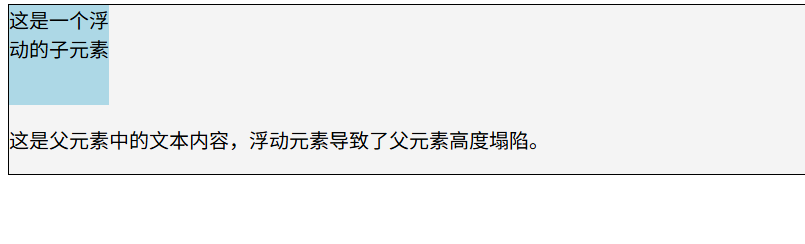

## 浮动导致父元素塌陷问题 ##

### 1. 浮动元素的特性 ###
- 浮动元素会脱离文档流，导致父元素高度塌陷。
- 没有浮动的时候，元素的样子是这样的：

父元素包含了子元素的高度，
- 添加了浮动之后，元素的样子是这样的：

### 2. 修复浮动导致的问题 ###
- 解决浮动导致的父元素高度塌陷问题有两种方法：
 1. 清除浮动
 
 2. 使用overflow:hidden属性
 效果是这样子的
 

### 3. 清除浮动的方式 ##
- 清除浮动的方式有很多种，最常用的有两种：
 1. 看过这幅图就明白清除浮动的时候left right or both
 