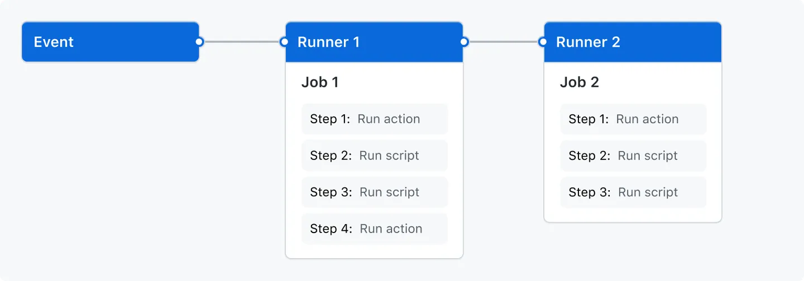

# github action知识积累

1. github action有哪些核心概念和基本术语

    - 首选需要知道的是事件和任务运行器
    

    - 一个workflow可以有多个job,这些job可以同步或者异步的运行在任务运行器中

    - 每个job一般来说可以运行脚本或者action

    - 每一个仓库可以有多个workflow,对应的就是在.github/workflows目录下新建多个yml文件,每个文件定义的workflow是不同的功能和任务

    - 事件就是触发任务执行的触发点,比如创建一个PR,创建一个issue,提交一个commit

    - job是一系列step的集合,多个job构成jobs;每个job在同一个runner中运行;job可以配置对其他job的依赖

    - actions是一种复杂且频繁的重复任务

    - runner是运行任务的执行器

2. 如何跳过CI的执行?在提交的信息中增加一个[skip ci]试试是否可行?