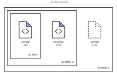

# 如何设计一个3D的立方体,顺便学习git的一些知识

## 理解git中的三棵树的基本架构

### git三棵树包括

1. 工作区(Working Directory):本地文件系统实际存在的文件,也就是我们写代码的地方.

2. 暂存区(Staging Area),也叫作索引(Index),保存了下一次将要提交的文件列表.

3. 版本库(Repository),保存了项目的所有历史版本,包括了各个版本的文件内存和版本信息等.这三棵树共同组成了 Git 的核心工作流程，让我们能够方便地管理版本、协作开发和撤销更改等操作。

#### git基础知识点

1. git add ./ReadMe.md 将ReadMe.md文件从Working Tree 添加到 Staging Tree后 git restore --staged .\ReadMe.md

2. git commit 的用法如下

3. git restore 的用法如下

4. 如何理解git中的分支模型

    - git分支是指向变更快照的指针(时间和空间需求上低开销)
    - 一个对变更修改进行封装的模型
    - 隔离问题代码，并行开发提高效率
    - git将分支存储为commit的引用,因此分支实际上是一些列commit的head
    - git branch可以看做是edit/stage/commit 过程的抽象

5. git 常用的一些命令是:
    - git branch
    - git branch -d <branch> //创建一个分支
    - git branch -D <branch> //删除分支
    - git branch -m <branch> //删除分支(force)
    - git branch -a <branch> //重命名分支
6. 如何将本地的分支推送到远程仓库?以及如何将不需要的branch在本地和远程删除?

7. 如何理解git中的checkout
    - checkout是一种在目标实体不同版本之间切换的行为,它主要对三种不同的实体进行操作:files,commits,branches
    - checkout和clone的区别,前者工作在本地,后者适用于远程
    - 如何checkout远程分支

    ```shell
    git fetch --all
    git checkout ＜remotebranch＞
    //old git version
    git checkout -b ＜remotebranch＞ origin/＜remotebranch＞ 

    git checkout -b ＜branchname＞
    git reset --hard origin/＜branchname＞
    ```

8. 为什么会创建git init --bare?什么时候使用 git init      directory --template=template_directory

    ```shell
      mkdir -p /path/to/template \ 
      echo "Hello World" >> /absolute/path/to/template/README \
      git init /new/repo/path --template=/absolute/path/to/template \ 
      cd /new/repo/path \ 
      cat /new/repo/path/README
    ```

9. git clone 有哪些使用场景?
    - 1. git clone <repo> <directory>
    - 2. git clone --branch <tag> <repo>

10. git stash 的本质是暂存
    - 1. git stash 默认会暂存staged change 和unstaged change,新建的文件和忽略的文件不会暂存

        ```shell
        $ git status
        On branch main
        Changes to be committed:

            new file:   style.css

        Changes not staged for commit:

            modified:   index.html

        $ git stash
        Saved working directory and index state WIP on main: 5002d47 our new homepage
        HEAD is now at 5002d47 our new homepage

        $ git status
        On branch main
        nothing to commit, working tree clean
        ```
    - 2. 恢复暂存信息的方法

        ```shell
        $ git status
        On branch main
        nothing to commit, working tree clean
        $ git stash pop
        On branch main
        Changes to be committed:

            new file:   style.css

        Changes not staged for commit:

            modified:   index.html

        Dropped refs/stash@{0} (32b3aa1d185dfe6d57b3c3cc3b32cbf3e380cc6a)

        //或者
        $ git stash apply
        On branch main
        Changes to be committed:

            new file:   style.css

        Changes not staged for commit:

            modified:   index.html

        //再来看一个demo
        $ script.js

        $ git status
        On branch main
        Changes to be committed:

            new file:   style.css

        Changes not staged for commit:

            modified:   index.html

        Untracked files:

            script.js

        $ git stash
        Saved working directory and index state WIP on main: 5002d47 our new homepage
        HEAD is now at 5002d47 our new homepage

        $ git status
        On branch main
        Untracked files:

            script.js

        //暂存没有跟踪的文件
        $ git status
        On branch main
        Changes to be committed:

            new file:   style.css

        Changes not staged for commit:

            modified:   index.html

        Untracked files:

            script.js

        $ git stash -u
        Saved working directory and index state WIP on main: 5002d47 our new homepage
        HEAD is now at 5002d47 our new homepage

        $ git status
        On branch main
        nothing to commit, working tree clean
        ```

        You can include changes to ignored files as well by passing the -a option (or --all) when running git stash.
        
    - 3. 如何操作多个stash

        ```shell
        //查看stash
        $ git stash list
        stash@{0}: WIP on main: 5002d47 our new homepage
        stash@{1}: WIP on main: 5002d47 our new homepage
        stash@{2}: WIP on main: 5002d47 our new homepage
        //命名stash
        $ git stash save "add style to our site"
        Saved working directory and index state On main: add style to our site
        HEAD is now at 5002d47 our new homepage

        $ git stash list
        stash@{0}: On main: add style to our site
        stash@{1}: WIP on main: 5002d47 our new homepage
        stash@{2}: WIP on main: 5002d47 our new homepage
        //恢复
        git stash pop == git stash pop stash@{0}
        git stash pop stash@{2}
        ```

    - 4. 展示stash

        ```shell
        $ git stash show
        index.html | 1 +
        style.css | 3 +++
        2 files changed, 4 insertions(+)

        $ git stash show -p
        diff --git a/style.css b/style.css
        new file mode 100644
        index 0000000..d92368b
        --- /dev/null
        +++ b/style.css
        @@ -0,0 +1,3 @@
        +* {
        +  text-decoration: blink;
        +}
        diff --git a/index.html b/index.html
        index 9daeafb..ebdcbd2 100644
        --- a/index.html
        +++ b/index.html
        @@ -1 +1,2 @@
        +<link rel="stylesheet" href="style.css"/>
        ```